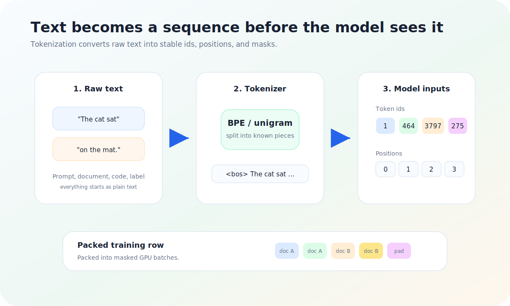
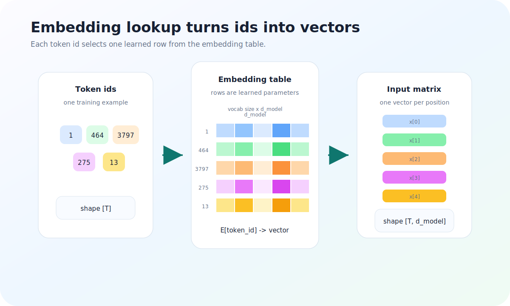
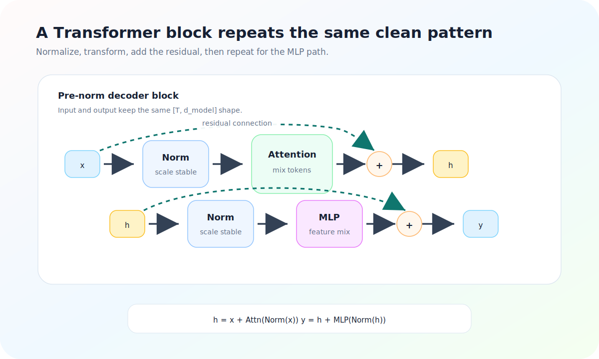
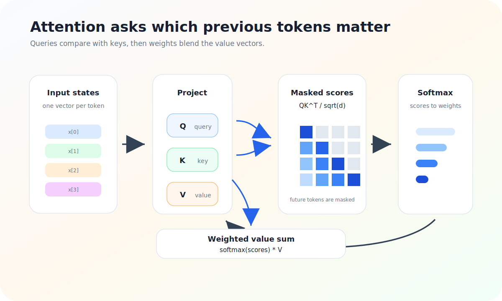
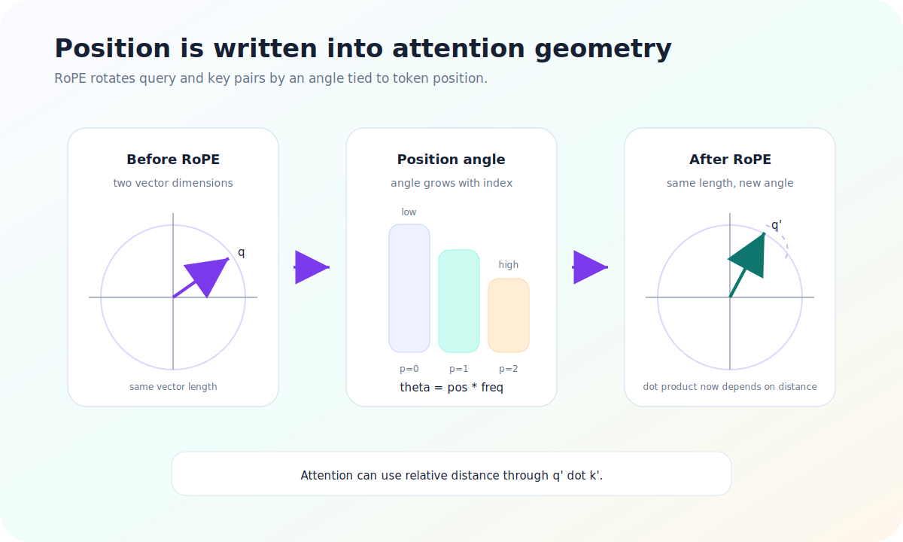
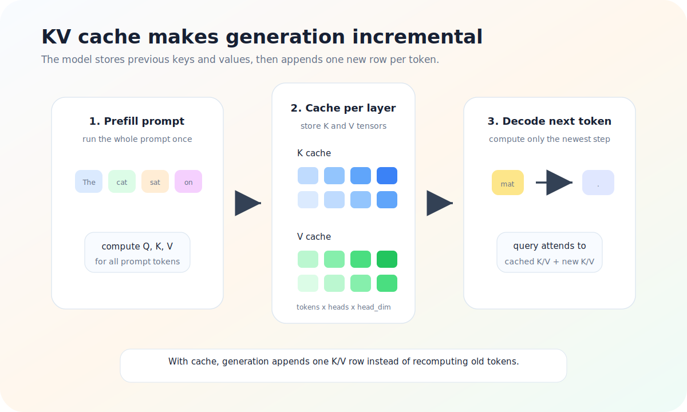

# Illustrated Transformer Notes

Reference article for visual style: [The Illustrated Transformer](https://www.aleksagordic.com/blog/transformer).

This note uses original SVG diagrams stored in `assets/figures/transformer/`. The goal is to make a paper review read like a blog post: each concept gets a short explanation and a figure that carries the main idea.

## 1. Tokenization

A Transformer never receives raw text directly. Text is converted into token ids, positions, and masks before it reaches the neural network.

Use this figure near the beginning of a blog post when introducing the input pipeline.

## 2. Embeddings

Token ids are only indexes. The embedding table turns each id into a dense vector, producing a matrix with shape `[sequence_length, d_model]`.

This figure is useful when explaining why the model can learn semantic and syntactic patterns from repeated token usage.

## 3. Transformer Block

Most Transformer implementations repeat the same block many times. A modern decoder block usually uses normalization, attention, residual addition, another normalization, and an MLP.

Keep the text around this figure focused on shape preservation: the input and output both remain `[T, d_model]`.

## 4. Attention

Attention compares the current query against keys from visible tokens, normalizes the scores, then mixes the corresponding value vectors.

This is the core figure for a Transformer article. It should appear before details like multi-head attention, RoPE, or caching.

## 5. Positional Encoding

Self-attention alone does not know token order. Rotary position encoding writes position into query and key geometry by rotating paired dimensions.

Use this section when moving from the original Transformer paper to modern LLM designs.

## 6. KV Cache

During generation, the model stores previous keys and values. Each new token can attend to the cache instead of recomputing the whole prompt.

This figure fits implementation notes, inference optimization, and serving discussions.

## Blog Writing Pattern

For future paper notes, use this structure:

1. Start with the pain point in plain language.
2. Add one diagram before the math.
3. Explain the diagram in three to five sentences.
4. Put formulas after the reader already has the intuition.
5. End each major section with the practical consequence.

## Figure Checklist

- Use one visual idea per figure.
- Label tensors with shapes when shape is the main lesson.
- Use consistent colors for repeated concepts.
- Prefer original diagrams over copied images.
- Keep captions short enough that the figure remains the focus.
